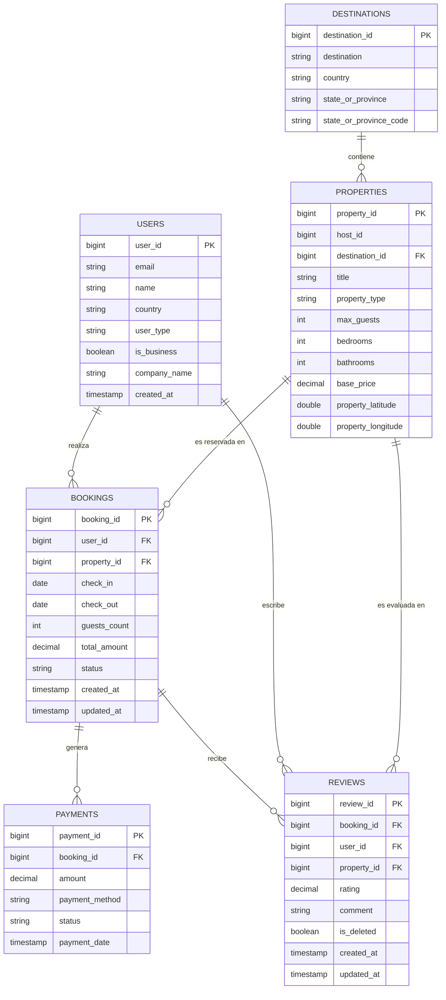

# Modelo Conceptual — Wanderbricks

Este diagrama representa las entidades principales del dominio de negocio (reservas de alojamiento turístico) y sus relaciones, antes de aplicar el modelado dimensional.

## Entidades

| Entidad | Descripción |
|---|---|
| **USERS** | Clientes registrados en la plataforma. Pueden ser personas individuales o cuentas empresariales (`is_business`). |
| **DESTINATIONS** | Ubicaciones geográficas (ciudad / estado / país) donde se ofertan propiedades. |
| **PROPERTIES** | Alojamientos disponibles para reserva. Cada uno pertenece a un destino y a un host. |
| **BOOKINGS** | Entidad transaccional central: una reserva conecta un usuario con una propiedad por un rango de fechas. |
| **PAYMENTS** | Movimientos financieros asociados a una reserva. Una reserva puede tener uno o varios pagos. |
| **REVIEWS** | Calificaciones y comentarios que un usuario deja sobre la propiedad luego de su estancia. |

## Reglas de negocio aplicadas en Silver

- Un `booking` válido tiene `check_out > check_in` y `total_amount > 0`.
- Solo se consideran `payments` con `amount > 0`.
- Solo se consideran `reviews` con `is_deleted = false` y `rating` entre 0 y 5.
- Cada entidad se deduplica por su PK conservando la versión más reciente (`updated_at` o `created_at`).
