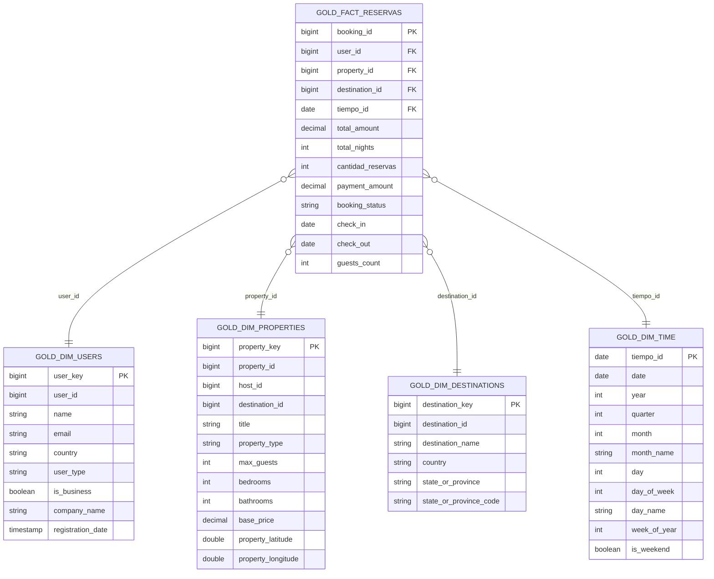

# Star Schema — Capa Gold

Modelo dimensional final de la capa Gold, optimizado para consultas analíticas y para alimentar los dashboards de Power BI.

## Tabla de hechos

### `gold_fact_reservas`

| Atributo | Tipo | Rol |
|---|---|---|
| `booking_id` | BIGINT | Grano (una fila por reserva) |
| `user_id` | BIGINT | FK → `gold_dim_users.user_key` |
| `property_id` | BIGINT | FK → `gold_dim_properties.property_key` |
| `destination_id` | BIGINT | FK → `gold_dim_destinations.destination_key` |
| `tiempo_id` | DATE | FK → `gold_dim_time.tiempo_id` (= `check_in`) |
| `total_amount` | DECIMAL(10,2) | **Métrica** — importe total de la reserva |
| `total_nights` | INT | **Métrica** — noches reservadas |
| `cantidad_reservas` | INT | **Métrica** — constante 1 (para SUM en agregaciones) |
| `payment_amount` | DECIMAL(10,2) | **Métrica** — suma de pagos completados |
| `booking_status` | STRING | Atributo descriptivo |
| `check_in`, `check_out`, `guests_count` | varios | Atributos descriptivos |

## Tablas de dimensiones

| Dimensión | PK | Atributos clave para análisis |
|---|---|---|
| `gold_dim_users` | `user_key` | country, user_type, is_business |
| `gold_dim_properties` | `property_key` | property_type, max_guests, base_price |
| `gold_dim_destinations` | `destination_key` | destination_name, country, state_or_province |
| `gold_dim_time` | `tiempo_id` | year, quarter, month, day_of_week, is_weekend |

## Preguntas analíticas que responde el modelo

1. **Ingresos** por país, región y propiedad.
2. **Reservas** por mes, trimestre y año.
3. **Ocupación** medida en `total_nights` por propiedad y por destino.
4. **Comportamiento de usuarios**: tipo, país, perfil empresarial vs individual.
5. **Desempeño de propiedades**: top alojamientos por ingreso y por número de reservas.
6. **Análisis geográfico**: distribución de ingresos por país y por región.

## Decisiones de diseño

- **Grano elegido**: una fila por reserva (`booking_id`). Es el evento atómico de negocio.
- **`destination_id` en la fact**: viene resuelto vía JOIN con `silver_properties` para que los dashboards puedan filtrar por destino sin tener que hacer el join cada vez.
- **Pre-agregación de pagos**: una reserva puede tener varios pagos; se hace `SUM(amount) GROUP BY booking_id` antes del JOIN para evitar duplicar filas de la fact.
- **`gold_dim_time` generada dinámicamente**: se construye con `SEQUENCE(MIN(check_in), MAX(check_out), INTERVAL 1 DAY)` para que el calendario se adapte al rango real de los datos sin hardcodear años.
- **Sin `description` en `gold_dim_destinations`**: el campo trae texto markdown extenso (~5 KB por fila) que no aporta al análisis dimensional y degradaría el rendimiento de Power BI.
